# Kubernetes Cluster Setup

> **Steps To Follow EKS Cluster Setup**

1. First Create IAM User with Admin access
2. Generate Access Key and Secret Access Key
3. Install AWS CLI
5. Install Kubectl
6. Install Eksctl
7. Configure environment variables from control panel
8. Create EKS Cluster By Using eksctl

----------------------------------------------------

1. **Create IAM User With Access Key & Secret Key**
    - Login to AWS console
    - Search IAM service
    - Click on Users
    - Create User - Demo-EKS-User

    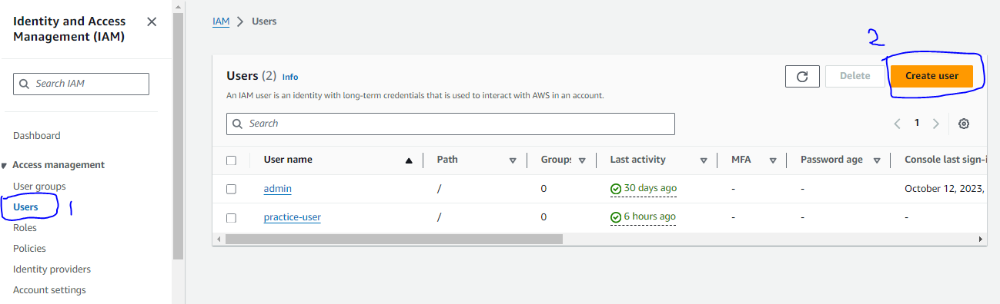

    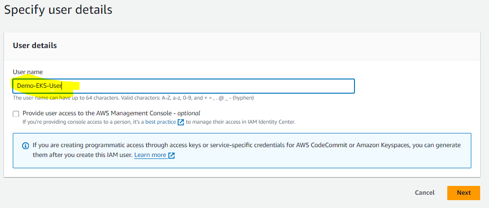

    - Click Next

    - For Practice Grant Administrator Access

    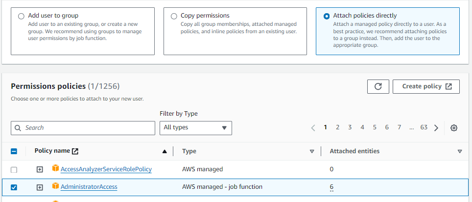

    - Click Next & Create User

    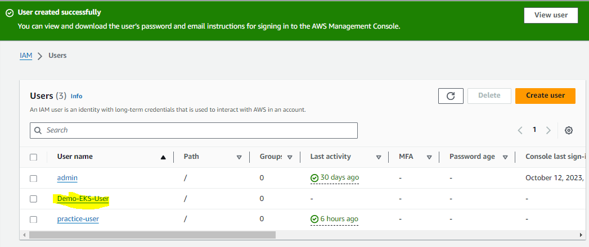

    - Click On Demo-EKS-User
    - Click on Security Credentials
    - Generate Access Key & Secret Access Key

    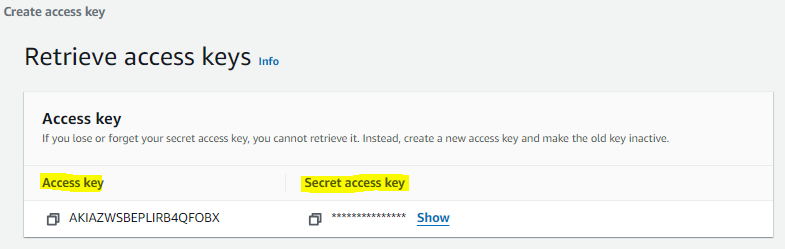

2. **Install AWS CLI**
    - Visit Link - https://docs.aws.amazon.com/cli/latest/userguide/getting-started-install.html
    - Download AWS CLI Based On The OS

    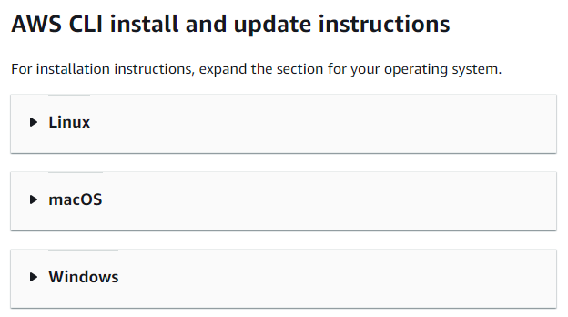

    - For Windows Expand It & Download EXE

    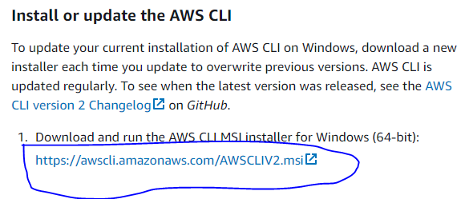

    - Once Download Completed Then Install It

    - Check AWS CLI Version - aws --version

    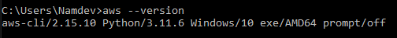

3. **Install Kubectl**
    - Visit Link https://docs.aws.amazon.com/eks/latest/userguide/install-kubectl.html
    - Install Kubernetes 1.29 Version By Command Line 
    - curl.exe -O https://s3.us-west-2.amazonaws.com/amazon-eks/1.29.0/2024-01-04/bin/windows/amd64/kubectl.exe
    - Once Installed Kubectl. Check Version # kubectl version --client
    
    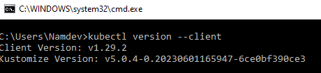

4. **Install Eksctl**
    - Visit Link - https://eksctl.io/installation/
    - Download EXE - AMD64/x86_64

    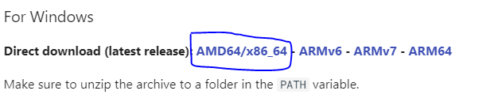

    - Once Downloaded Then Unzip It

    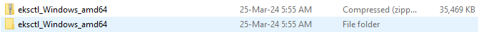

    - Rename Folder eksctl_Windows_amd64 to eksctl
    - Copy & Paste Into C:\Program Files\eksctl

    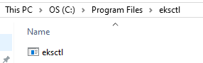

5. **Configure Environment Variable**
    - Open Control Panel
    - Click On System

    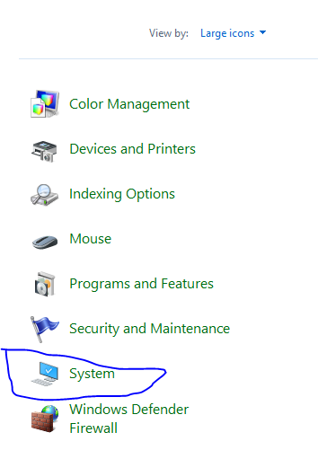

    - Click On Advanced System Settings

    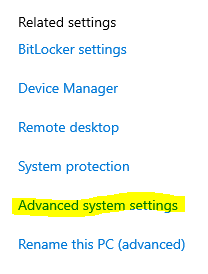

    - Click On Environment Variables

    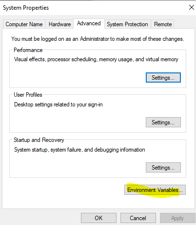

    - Select Path & Click On Edit

    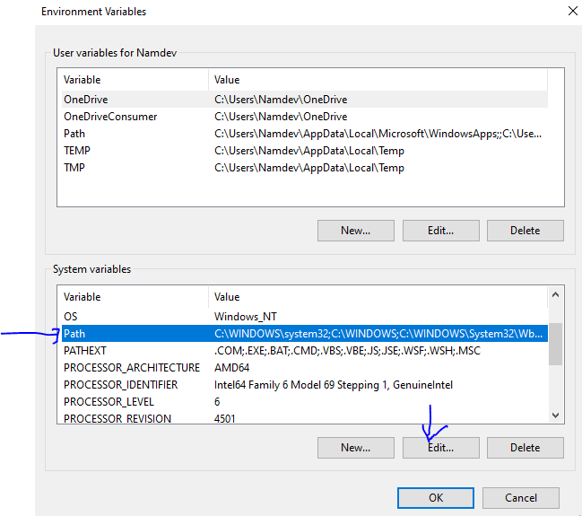

    - Add Eksctl Path & Click Ok

    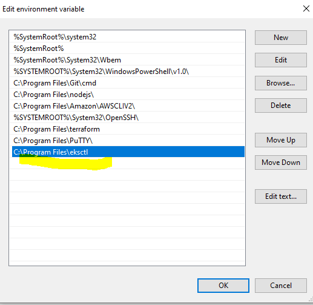

6. **Create EKS Cluster By Eksctl**
    - Use Below Command To Create EKS Cluster
    
    ```
    eksctl create cluster --name demo-cluster --version 1.29 --region ap-south-1 --nodegroup-name standard-workers --node-type t3.medium --nodes 2 --managed

    ```


